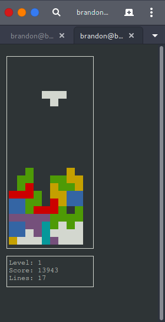

# Tetris

Yet another Tetris implementation, written in C with a Curses frontend.

## Building and Installing
By default, tetris is installed into your user's ~/bin directory. To install, from the project root run:
```
$ mkdir build
$ cd build
$ cmake ..
$ make install

$ ~/bin/tetris
```

For a global install, run from the project root:
```
$ mkdir build
$ cd build
$ cmake -DCMAKE_INSTALL_PREFIX=/usr/local ..
$ make install

$ tetris
```

## Usage
Want to play?
```
$ tetris
```

# Controls
- Move tetriminos using the ASD or arrow keys: <kbd>→</kbd><kbd>↓</kbd><kbd>←</kbd> or <kbd>d</kbd><kbd>s</kbd><kbd>a</kbd>
- Rotate tetriminos with the spacebar: <kbd>⎵</kbd>
- Pause the game by pressing 'p' key: <kbd>p</kbd>
- Quit the game by pressing the 'q' key: <kbd>q</kbd>